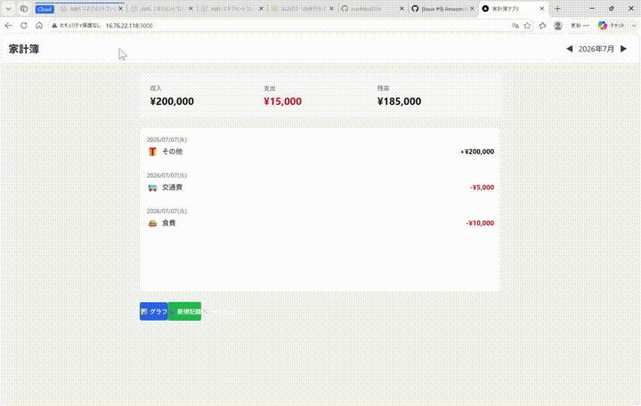

# 家計簿アプリ

シンプルで使いやすい家計簿管理アプリケーション。日々の収支をカテゴリ分けして記録し、月別に集計・グラフで確認できます。

## 🎯 主な機能

- ✅ 収支の記録・編集・削除
- ✅ カテゴリ管理（追加・削除）
- ✅ 月別集計（収入・支出・残高）
- ✅ グラフ表示（過去6ヶ月）
- ✅ 過去データ閲覧

## 📹 デモ



**操作内容：**
- 記録追加フォーム
- 新規カテゴリ追加
- 記録削除
- グラフ表示確認

## 🏗️ アーキテクチャ

### クラウド構成（AWS）

```
ブラウザ
   ↓ HTTP (http://52.197.32.171)
Nginx（リバースプロキシ） - EC2
   ├─ / → Next.js フロント（ポート 3000）
   ├─ /api/* → Flask バック（ポート 5000）
   └─ Docker Compose で管理
   ↓ SQL
RDS MySQL（データベース）
```

### 技術スタック

| レイヤー | 技術 |
|---------|------|
| **フロントエンド** | Next.js 14 + React + TypeScript + recharts |
| **バックエンド** | Python 3.11 + Flask + SQLAlchemy |
| **データベース** | MySQL 8.0（RDS） |
| **インフラ** | AWS EC2 + RDS + Docker + Nginx |
| **IaC** | Terraform |

## 🚀 デプロイ手順

### 前提条件
- AWS アカウント
- Terraform インストール
- AWS CLI 認証済み

### Step 1: Terraform で AWS リソース構築

```bash
cd terraform
terraform init
terraform plan
terraform apply
```

**出力例：**
```
ec2_public_ip = "52.197.32.171"
rds_address = "terraform-xxx.rds.amazonaws.com"
```

### Step 2: EC2 初回起動待機（5-10分）

user_data.sh が自動実行され、以下が行われます：
- Docker インストール
- リポジトリ clone + git LFS pull
- docker-compose で全サービス起動（バック + フロント + Nginx）

### Step 3: ブラウザでアクセス

```
http://52.197.32.171
```

## 📝 ローカル開発環境

### Prerequisites
- Docker Desktop
- Git LFS

### 起動コマンド

```bash
# リポジトリクローン
git clone https://github.com/norihiko0326/raise-tech-beginner-assignment.git
cd raise-tech-beginner-assignment

# Git LFS セットアップ
git lfs install
git lfs pull

# .env ファイル作成（ローカル用）
cat > .env << EOF
DB_HOST=localhost
DB_PASSWORD=testpassword123
EOF

# Docker Compose 起動
docker-compose up -d

# ブラウザアクセス
http://localhost
```

### 開発用コマンド

```bash
# ログ確認
docker-compose logs -f

# 特定サービスのみ再起動
docker-compose restart backend
docker-compose restart frontend
docker-compose restart nginx

# 完全クリーンアップ
docker-compose down -v
```

## 🔄 CI/CD（今後の改善案）

- GitHub Actions で自動テスト
- Terraform Plan/Apply の自動化
- Docker イメージレジストリ（ECR）
- デプロイ自動化

## 📚 詳細ドキュメント

- [画面仕様書](docs/01_SCREEN_SPECIFICATIONS.md)
- [API 仕様](docs/04_API_SPECIFICATION.md)
- [データベース設計](docs/03_DATABASE_DESIGN.md)
- [技術スタック](docs/05_TECHNOLOGY_STACK.md)
- [デプロイ計画](DEPLOYMENT_PLAN.md)

## 💡 実装時の工夫

1. **インフラ as Code（IaC）**
   - Terraform で AWS リソースをコード化
   - 再現性・版管理が容易

2. **コンテナ化**
   - Docker で環境の統一
   - 本番環境との差異を排除

3. **リバースプロキシ（Nginx）**
   - フロント・バック分離
   - CORS 対応
   - API ルーティング統一

4. **自動デプロイ**
   - user_data.sh で EC2 初回起動時に全て自動
   - 手作業ゼロ

## 🛠️ トラブルシューティング

### EC2 でコンテナが起動しない

```bash
# SSH でログイン
ssh -i your-key.pem ec2-user@52.197.32.171

# ログ確認
docker-compose logs

# 再起動
docker-compose restart
```

### フロント・バック API 連携エラー

```bash
# Nginx ログ確認
docker exec household-app-nginx tail -f /var/log/nginx/access.log
docker exec household-app-nginx tail -f /var/log/nginx/error.log
```

## 📦 リソースクリーンアップ

```bash
# AWS リソース削除
cd terraform
terraform destroy
```

## 👤 作成者

norihiko0326

## 📄 ライセンス

MIT

---

**最終更新：** 2026年7月3日
