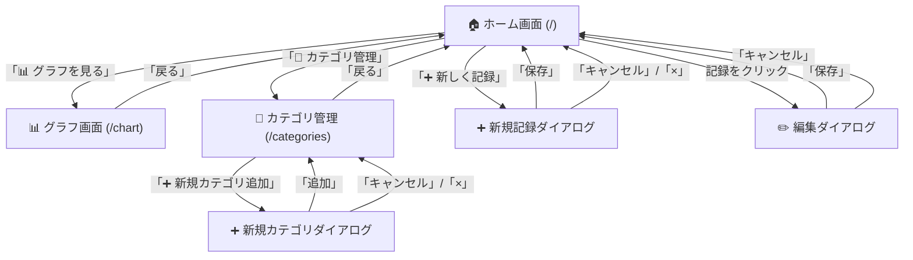

# 画面遷移図

**[← REQUIREMENTS.md に戻る](../REQUIREMENTS.md)**

---

## Mermaid 遷移図

---

## 遷移フロー詳細

### 月選択による動的更新

- ホーム画面で「◀ / ▶」ボタンをクリック → 月が変更される
- サマリー（収入・支出・残高）が更新される
- 記録一覧が自動的に再取得・再描画される
- **画面遷移ではなく、ページ内の部分更新**

### ダイアログの動作

- モーダルダイアログとして表示（背景は暗くなる）
- ダイアログ外をクリック → ダイアログを閉じない（クリックは無視）
- ダイアログ内の「×」または「キャンセル」 → ダイアログを閉じる（入力は破棄）
- 「保存」/「追加」 → バリデーション → API実行 → 成功時にダイアログを閉じて一覧を更新

---

## 遷移表

| 画面（URL） | 遷移元 | 遷移先 | トリガー |
|---|---|---|---|
| **ホーム画面 (/)** | - | グラフ、新規記録、カテゴリ管理 | 初期表示、各画面から戻る |
| **グラフ画面 (/chart)** | ホーム | ホーム | 「📊 グラフを見る」ボタン、「戻る」ボタン |
| **新規記録ダイアログ** | ホーム | ホーム | 「➕ 新しく記録」ボタン、「保存」「キャンセル」「×」 |
| **編集ダイアログ** | ホーム | ホーム | 記録一覧の行をクリック、「保存」「キャンセル」 |
| **カテゴリ管理画面 (/categories)** | ホーム | ホーム、新規カテゴリダイアログ | 「🔧 カテゴリ管理」ボタン、「戻る」ボタン |
| **新規カテゴリダイアログ** | カテゴリ管理 | カテゴリ管理 | 「➕ 新規カテゴリ追加」、「追加」「キャンセル」「×」 |

---

**[← REQUIREMENTS.md に戻る](../REQUIREMENTS.md)**
